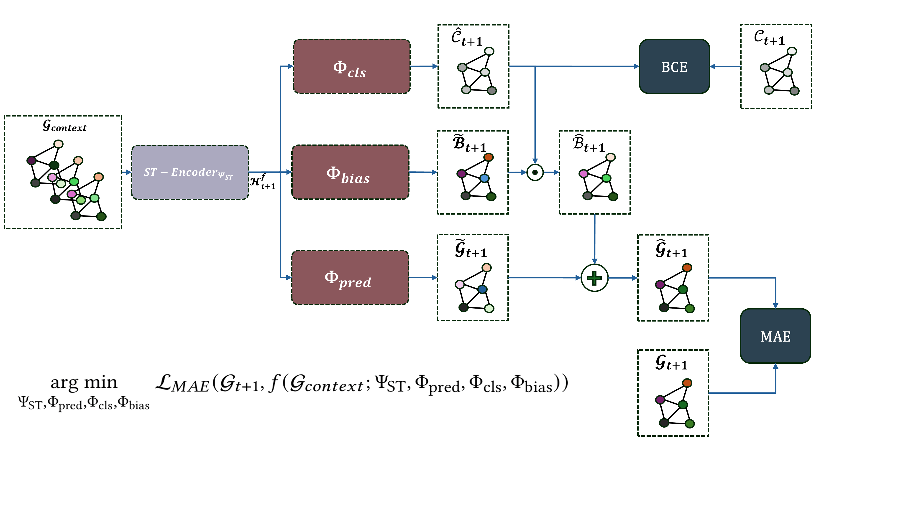
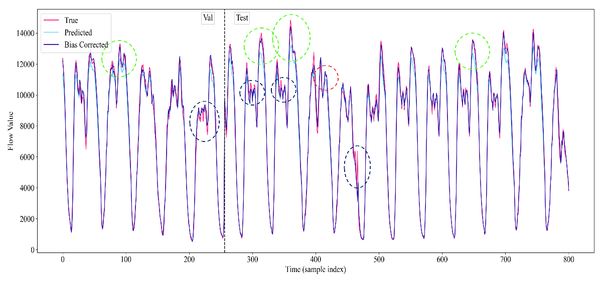

# **Hyb-STEX: A Hybrid Model for Spatio-Temporal Traffic Flow Forecasting with Extreme Event Modeling**

This repository contains the official PyTorch implementation of **Hyb-STEX**, a hybrid model designed for accurate spatio-temporal traffic flow forecasting with a focus on extreme event modeling. The work is based on our work:

> **[Hyb-STEX: A Hybrid Model for Spatio-Temporal Traffic Flow Forecasting with Extreme Event Modeling](<https://drive.google.com/file/d/17r1Dv8AVi2Ztdl5DECMqtFV_PDsMwNhm/view?usp=sharing>)**  
> (Manuscript uploaded on Google Drive)  
> Under review at Association for Computing Machinery Transactions on Knowledge Discovery from Data (ACM TKDD).



## Datasets

The datasets range from `{NYCBike1, NYCBike2, NYCTaxi, BJTaxi}`. These dataset links and preprocessing steps are reused from the original ST-SSL implementation. You can download them from [GitHub repo](https://github.com/Echo-Ji/ST-SSL_Dataset), [Beihang Cloud Drive](https://bhpan.buaa.edu.cn/link/AAF30DD8F4A2D942F7A4992959335C2780), or [Google Drive](https://drive.google.com/file/d/1n0y6X8pWNVwHxtFUuY8WsTYZHwBe9GeS/view?usp=sharing).

Each dataset is composed of 4 files, namely `train.npz`, `val.npz`, `test.npz`, and `adj_mx.npz`.

```
|----NYCBike1\
|    |----train.npz    # training data
|    |----adj_mx.npz   # predefined graph structure
|    |----test.npz     # test data
|    |----val.npz      # validation data
```

The `train/val/test` data is composed of 4 `numpy.ndarray` objects:

* `X`: input data. It is a 4D tensor of shape `(#samples, #lookback_window, #nodes, #flow_types)`, where `#` denotes the number sign. 
* `Y`: data to be predicted. It is a 4D tensor of shape `(#samples, #predict_horizon, #nodes, #flow_types)`. Note that `X` and `Y` are paired in the sample dimension. For instance, `(X_i, Y_i)` is the `i`-the data sample with `i` indexing the sample dimension.
* `X_offset`: a list indicating offsets of `X`'s lookback window relative to the current time with offset `0`.  
* `Y_offset`: a list indicating offsets of `Y`'s prediction horizon relative to the current time with offset `0`.

For all datasets, previous 2-hour flows as well as previous 3-day flows around the predicted time are used to forecast flows for the next time step.

`adj_mx.npz` is the graph adjacency matrix that indicates the spatial relation of every two regions/nodes in the studied area. 

⚠️ Note that all datasets are processed as a sliding window view. Raw data of **NYCBike1** and **BJTaxi** are collected from [STResNet](https://ojs.aaai.org/index.php/AAAI/article/view/10735). Raw data of **NYCBike2** and **NYCTaxi** are collected from [STDN](https://ojs.aaai.org/index.php/AAAI/article/view/4511).

### Additional Preprocessing Steps

For this project, the datasets were further preprocessed to include binary extreme values tensors. This preprocessing was conducted using the `createDataWithEVLabels.ipynb` file. To create the final datasets, follow the complete steps outlined in the `createDataWithEVLabels.ipynb` notebook. The key saving line in this preprocessing is as follows:

```python
np.savez(data_path, x=x_train, y=y_train, evs_90=extreme_values_binary_tensor)
```

This process adds an additional binary tensor (`evs_90`) representing extreme values to the original sliding window datasets.


## **Model Training and Evaluation**

### **Training**
To run experiments across multiple seeds and datasets, use the provided `run_experiments.bat` script:
```bash
run_experiments.bat
```
This script automates the training process for reproducibility and consistency.

For advanced configurations and command-line arguments, refer to the main.py file. Key options include:

* config_filename: Specify the config file to use, includes alll configuration including the dataset to be used.
* comment: Comment for the experiment, included in the save directory.

Example usage:

```bash
Copy code
python main.py -c "example run on NYCBike1" -s 1 -cf configs/NYCBike1.yaml
```

### **Evaluation**
You can evaluate the trained model using one of the following methods:

1. Using the Mode Argument in Configs:

  > Set the mode argument in the configs.yaml file to 'test'.
  > Run the script to evaluate the model with the desired settings. Provide 'load_path' to the trained model.

2. Using the EvaluateModel.ipynb Notebook:

  Open the EvaluateModel.ipynb notebook for detailed evaluation capabilities:
  * Evaluate a list of trained models.
  * Plot predictions (with and without bias correction).
  * Independently evaluate the model’s classifier and generate a confusion matrix.

  Example evaluation features:

  * Generate visual comparisons of predicted vs. actual values.
  * Quantify prediction errors and metrics (e.g., MAE, EEE).
  * Analyze classification performance using confusion matrix and f1-score.

  #### Results Visualization

   The figure below demonstrates **the motivation**, **performance improvements**, and **remaining challenges** of Hyb-STEX:

   
   
   *This figure illustrates the performance of our model on the validation and test split of NYCTaxi dataset. The plot is for the total city wide inflow i.e., inflow summed over all nodes. Green circles highlight regions where the bias correction significantly improved the predictions, particularly in cases where the base model under-predicted. Red circle indicates the area where the model over-corrected due to false positives of the extreme event classifier. Blue circles mark instances of missed corrections, where highly local extreme values or left extreme values were not addressed by the model due to the limitation of how we currently define extreme values, these insights guide our future work.*

---

## **Acknowledgment**

This work builds upon the foundation of **ST-SSL**, implemented in the paper:

> **J. Ji**, J. Wang, C. Huang, et al.  
> "[Spatio-Temporal Self-Supervised Learning for Traffic Flow Prediction](https://ojs.aaai.org/index.php/AAAI/article/view/25555)"  
> *Proceedings of the AAAI Conference on Artificial Intelligence, 2023.*

We have utilized the **ST-SSL** codebase and data pipeline as the starting point for this research, and we extend it with additional functionalities and methodologies to develop **Hyb-STEX**. We sincerely thank the authors of **ST-SSL** for making their implementation and datasets publicly available, which enabled our work.

You can find the original implementation of **ST-SSL** here:  
🔗 [ST-SSL GitHub Repository](https://github.com/Echo-Ji/ST-SSL)

