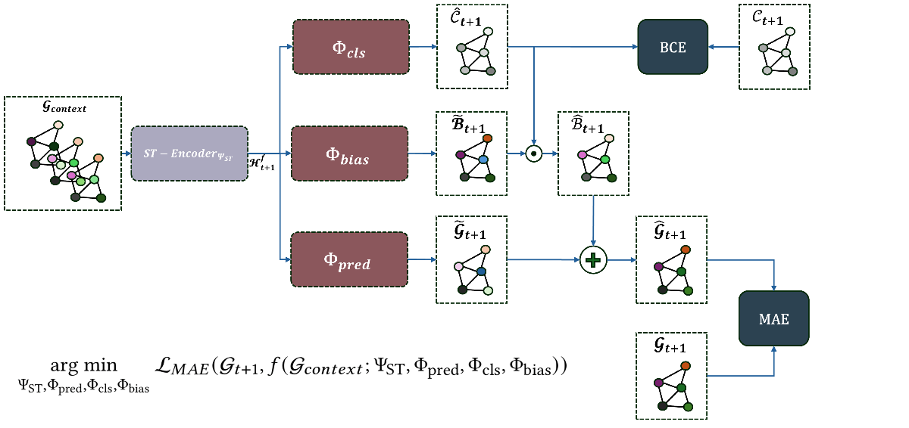

# **Hyb-STEX: A Hybrid Model for Spatio-Temporal Traffic Flow Forecasting with Extreme Event Modeling**

This repository contains the official PyTorch implementation of **Hyb-STEX**, a hybrid model designed for accurate spatio-temporal traffic flow forecasting with a focus on extreme event modeling. The work is based on our manuscript:

> **[Hyb-STEX: A Hybrid Model for Spatio-Temporal Traffic Flow Forecasting with Extreme Event Modeling](<https://drive.google.com/file/d/17r1Dv8AVi2Ztdl5DECMqtFV_PDsMwNhm/view?usp=sharing>)**  
> (Manuscript uploaded on Google Drive)  
> Under review at Association for Computing Machinery Transactions on Knowledge Discovery from Data (ACM TKDD).  





## Requirement

We build this project by Python 3.8 with the following packages: 
```
numpy==1.21.2
pandas==1.3.5
PyYAML==6.0
torch==1.10.1
```

## Datasets

The datasets range from `{NYCBike1, NYCBike2, NYCTaxi, BJTaxi}`. You can download them from [GitHub repo](https://github.com/Echo-Ji/ST-SSL_Dataset), [Beihang Cloud Drive](https://bhpan.buaa.edu.cn/link/AAF30DD8F4A2D942F7A4992959335C2780), or [Google Drive](https://drive.google.com/file/d/1n0y6X8pWNVwHxtFUuY8WsTYZHwBe9GeS/view?usp=sharing).

Each dataset is composed of 4 files, namely `train.npz`, `val.npz`, `test.npz`, and `adj_mx.npz`.

```
|----NYCBike1\
|    |----train.npz    # training data
|    |----adj_mx.npz   # predefined graph structure
|    |----test.npz     # test data
|    |----val.npz      # validation data
```

The `train/val/test` data is composed of 4 `numpy.ndarray` objects:

* `X`: input data. It is a 4D tensor of shape `(#samples, #lookback_window, #nodes, #flow_types)`, where `#` denotes the number sign. 
* `Y`: data to be predicted. It is a 4D tensor of shape `(#samples, #predict_horizon, #nodes, #flow_types)`. Note that `X` and `Y` are paired in the sample dimension. For instance, `(X_i, Y_i)` is the `i`-the data sample with `i` indexing the sample dimension.
* `X_offset`: a list indicating offsets of `X`'s lookback window relative to the current time with offset `0`.  
* `Y_offset`: a list indicating offsets of `Y`'s prediction horizon relative to the current time with offset `0`.

For all datasets, previous 2-hour flows as well as previous 3-day flows around the predicted time are used to forecast flows for the next time step.

`adj_mx.npz` is the graph adjacency matrix that indicates the spatial relation of every two regions/nodes in the studied area. 

⚠️ Note that all datasets are processed as a sliding window view. Raw data of **NYCBike1** and **BJTaxi** are collected from [STResNet](https://ojs.aaai.org/index.php/AAAI/article/view/10735). Raw data of **NYCBike2** and **NYCTaxi** are collected from [STDN](https://ojs.aaai.org/index.php/AAAI/article/view/4511).

## Model training and Evaluation

If the environment is ready, please run the following commands to train the model on the specific dataset from `{NYCBike1, NYCBike2, NYCTaxi, BJTaxi}`.
```bash
>> cd ST-SSL
>> ./runme 0 NYCBike1   # 0 specifies the GPU id, NYCBike1 gives the dataset
```

Note that this repo only contains the NYCBike1 data because including all datasets can make this repo heavy.

## **Acknowledgment**

This work builds upon the foundation of **ST-SSL**, implemented in the paper:

> **J. Ji**, J. Wang, C. Huang, et al.  
> "[Spatio-Temporal Self-Supervised Learning for Traffic Flow Prediction](https://ojs.aaai.org/index.php/AAAI/article/view/25555)"  
> *Proceedings of the AAAI Conference on Artificial Intelligence, 2023.*

We have utilized the **ST-SSL** codebase and data pipeline as the starting point for this research, and we extend it with additional functionalities and methodologies to develop **Hyb-STEX**. We sincerely thank the authors of **ST-SSL** for making their implementation and datasets publicly available, which enabled our work.

You can find the original implementation of **ST-SSL** here:  
🔗 [ST-SSL GitHub Repository](https://github.com/Echo-Ji/ST-SSL)

